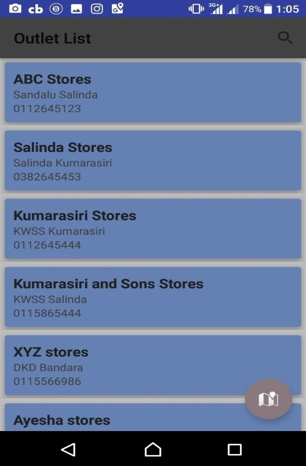

### Sales Force Automation

The developed solution has the major feature of an Android mobile application. The android application is designed for the sales rep 
allowing him to sign in if registered with server after providing relevant authentication details, and to easily record his daily
activities, submit his reports quickly and access records in few clicks. So the solution mainly includes designing an android mobile
application for sales representatives to work under offline conditions with many functionalities in the process of sales activities.
An android app is designed with all the features needed to automate the process of sales representatives
with the solution of enabling offline data syn. The application is designed to work under both online and offline conditions.
At online conditions data is transferred to the main database and retrieve data from the main database. At offline conditions data is
stored without allowing to be lost and the data is synchronized as soon as the connections are reset.

## How to login? 
Provide the username and password provided to you by the administration in this interface. 
Press login button. 

## How to logout?  – The Home Page  
You can logout by pressing the logout button.  
Use these icons in the homepage to do your specific task  
•	Outlets – To see outlets  
•	Expenses – To see and add  expenses  
•	Products – To see product details  
•	Leave – To apply leave  
•	Billing – To do all transactions in an outlet.  
•	Routes – To see your route in map  
•	Messages – To chat with your friends  
•	Reports – To see your summary reports 

## How to see products? 
Press the Products icon in the home page 
You can see all the products available 
Type the name, brand or the category in the search bar to search any product by name, category or brand. 
Touch on any product to see its all details. 

## How to see outlets? 
Press the Outlet icon in home page. 
You can see all the Outlets available. 
Type the name of the outlet or name of the owner in the search bar to search any outlet. 
Touch on any outlet to see its map with the route from your location. 

## How to see routes assigned to you? 
Press the Routes icon in the home page  
Now you can see all the outlets of the route assigned to you on the map. 
Touch on any outlet to see its name 

## How to apply a leave? 
Press the Leave icon in the home page 
Go to the “Add Leave” tab 
Enter your starting date, Ending date and Reason 
Press Submit button 
You can see the confirmation of your leave and other leave details by going to “My Leaves” tab. 

## How to apply an expense? 
Press the Expenses icon in the home page. Enter your date, description and amount. Press Submit button

## How to see your reports? 
Press the reports icon in the home page You can see 6 types of reports.  
•	My Monthly Sales – You can see the summary of your sales in a selected month  
•	My Sales Of Last 12 Months – You can see the summary of your sales of last 12 months  
•	Monthly Sales by Outlet – You can see the sales summary of  a selected outlet of a selected month  • 	Sales of Last 12 months by Outlet – You can see the sales summary of a selected outlet in last 12 months  • 	Monthly Sales by Route - You can see the sales summary of  a selected route of a selected month  • 	Sales of Last 12 months by Outlet – You can see the sales summary of a selected route in last 12 months  

##  How to chat with other users? 
 
Press the Messages icon in the home page You can see all the Users of the App Select any user you want Now you can send messages just like any other chat application  

## How to place an order? 

Press the Billing icon in the Home page You can see 4 tabs  
•	Van Order – Shows the list of products available in the van with details   
•	Pre Order – Shows the list of products in the main storage   • Return – Shows the list of products that has been purchased by an specific outlet    
•	Bill Summary – Shows a summary of the bill   

 

Touch on the product you want to place pre order, van order or return 
Enter the quantity as shown in figure 
You can add any no of products customer needs 
 

After adding all the products go to bill summary tab 
You can see a summary of the transaction to be done 
If all the aspects are correct you can press the Accept button  
 

Now you can see this interface 
You can add any description you want 
The amount of the products, outstanding amount if available and the total amount to be paid is displayed 
Enter the amount which is paid by the customer 
Select the method of payment 
Press Accept button  
 

 
 
 
 

